## 实战

### 需求

使用highcharts统计与可视化网站服务器当前实例的QPS信息、当前实例所在的机器的CPU占用率、当前实例内存占用（包含已分配、已使用和内存总大小）、最近30天网站访问量（PV），最近30天用户访问量（UV）、近7日注册和登录用户（UV）数、当日ip所属地区访问统计


### 分析

* QPS信息：动态折线图
* 当前实例所在的机器的CPU占用率：速度仪表图
* 当前实例内存占用：基础面积图
* 最近30天网站访问量：柱状图
* 最近30天用户访问量：柱状图
* 近7日注册和登录用户（UV）数：柱状图
* 当日ip所属地区访问统计：饼图


### 实现

#### pom文件

```xml
<dependencies>

    <dependency>
        <groupId>org.springframework.boot</groupId>
        <artifactId>spring-boot-starter-web</artifactId>
    </dependency>

    <dependency>
        <groupId>org.springframework.boot</groupId>
        <artifactId>spring-boot-starter-test</artifactId>
        <scope>test</scope>
    </dependency>

    <!--spring-boot lombok-->
    <dependency>
        <groupId>org.projectlombok</groupId>
        <artifactId>lombok</artifactId>
        <optional>true</optional>
    </dependency>

</dependencies>
```


#### 全局异常处理ExceptionHandler

```java
package mao.data_visualization_highcharts_website_statistics.config;

import lombok.extern.slf4j.Slf4j;
import mao.data_visualization_highcharts_website_statistics.entity.R;
import org.springframework.context.annotation.Configuration;
import org.springframework.web.bind.annotation.RestControllerAdvice;

/**
 * Project name(项目名称)：data_visualization_highcharts_website_statistics
 * Package(包名): mao.data_visualization_highcharts_website_statistics.config
 * Class(类名): ExceptionHandler
 * Author(作者）: mao
 * Author QQ：1296193245
 * GitHub：https://github.com/maomao124/
 * Date(创建日期)： 2023/6/12
 * Time(创建时间)： 19:10
 * Version(版本): 1.0
 * Description(描述)： 无
 */

@Slf4j
@Configuration
@RestControllerAdvice
public class ExceptionHandler
{
    @org.springframework.web.bind.annotation.ExceptionHandler(Exception.class)
    public R<Object> exception(Exception e)
    {
        log.error("错误：", e);
        return R.fail("系统繁忙，请稍后再试");
    }
}
```


#### 实体类IpCount

```java
package mao.data_visualization_highcharts_website_statistics.entity;

import lombok.*;
import lombok.experimental.Accessors;

/**
 * Project name(项目名称)：data_visualization_highcharts_website_statistics
 * Package(包名): mao.data_visualization_highcharts_website_statistics.entity
 * Class(类名): IpCount
 * Author(作者）: mao
 * Author QQ：1296193245
 * GitHub：https://github.com/maomao124/
 * Date(创建日期)： 2023/6/12
 * Time(创建时间)： 19:51
 * Version(版本): 1.0
 * Description(描述)： 无
 */

@Data
@AllArgsConstructor
@NoArgsConstructor
@Builder
@ToString
@EqualsAndHashCode
@Accessors(chain = true)
public class IpCount
{
    /**
     * 区域
     */
    private String area;

    /**
     * 统计
     */
    private int count;
}
```


#### 实体类LoginAndRegistrationCount

```java
package mao.data_visualization_highcharts_website_statistics.entity;

import lombok.*;
import lombok.experimental.Accessors;

/**
 * Project name(项目名称)：data_visualization_highcharts_website_statistics
 * Package(包名): mao.data_visualization_highcharts_website_statistics.entity
 * Class(类名): LoginAndRegistrationCount
 * Author(作者）: mao
 * Author QQ：1296193245
 * GitHub：https://github.com/maomao124/
 * Date(创建日期)： 2023/6/12
 * Time(创建时间)： 15:08
 * Version(版本): 1.0
 * Description(描述)： 无
 */

@Data
@AllArgsConstructor
@NoArgsConstructor
@Builder
@ToString
@EqualsAndHashCode
@Accessors(chain = true)
public class LoginAndRegistrationCount
{
    /**
     * 格式化的日期
     */
    private String date;

    /**
     * 当日数据
     */
    private int count;
}
```


#### 实体类Memory

```java
package mao.data_visualization_highcharts_website_statistics.entity;

import lombok.*;
import lombok.experimental.Accessors;

/**
 * Project name(项目名称)：data_visualization_highcharts_website_statistics
 * Package(包名): mao.data_visualization_highcharts_website_statistics.entity
 * Class(类名): Memory
 * Author(作者）: mao
 * Author QQ：1296193245
 * GitHub：https://github.com/maomao124/
 * Date(创建日期)： 2023/6/11
 * Time(创建时间)： 23:04
 * Version(版本): 1.0
 * Description(描述)： 无
 */

@Data
@AllArgsConstructor
@NoArgsConstructor
@Builder
@ToString
@EqualsAndHashCode
@Accessors(chain = true)
public class Memory
{
    /**
     * 当前已使用的内存，单位为M
     */
    private Double use;

    /**
     * jvm分配到的内存，单位为M
     */
    private Double max;

    /**
     * 当前机器最大内存
     */
    private Double total;
}
```


#### 实体类PVCount

```java
package mao.data_visualization_highcharts_website_statistics.entity;

import lombok.*;
import lombok.experimental.Accessors;

/**
 * Project name(项目名称)：data_visualization_highcharts_website_statistics
 * Package(包名): mao.data_visualization_highcharts_website_statistics.entity
 * Class(类名): PVCount
 * Author(作者）: mao
 * Author QQ：1296193245
 * GitHub：https://github.com/maomao124/
 * Date(创建日期)： 2023/6/11
 * Time(创建时间)： 23:40
 * Version(版本): 1.0
 * Description(描述)： 无
 */

@Data
@AllArgsConstructor
@NoArgsConstructor
@Builder
@ToString
@EqualsAndHashCode
@Accessors(chain = true)
public class PVCount
{
    /**
     * 格式化的日期
     */
    private String date;

    /**
     * 当日数据
     */
    private int count;
}
```


#### 实体类UVCount

```java
package mao.data_visualization_highcharts_website_statistics.entity;

import lombok.*;
import lombok.experimental.Accessors;

/**
 * Project name(项目名称)：data_visualization_highcharts_website_statistics
 * Package(包名): mao.data_visualization_highcharts_website_statistics.entity
 * Class(类名): UVCount
 * Author(作者）: mao
 * Author QQ：1296193245
 * GitHub：https://github.com/maomao124/
 * Date(创建日期)： 2023/6/11
 * Time(创建时间)： 23:41
 * Version(版本): 1.0
 * Description(描述)： 无
 */

@Data
@AllArgsConstructor
@NoArgsConstructor
@Builder
@ToString
@EqualsAndHashCode
@Accessors(chain = true)
public class UVCount
{
    /**
     * 格式化的日期
     */
    private String date;

    /**
     * 当日数据
     */
    private int count;
}
```


#### 实体类R

```java
package mao.data_visualization_highcharts_website_statistics.entity;

import lombok.*;
import lombok.experimental.Accessors;

import java.util.Date;
import java.util.Map;

/**
 * Project name(项目名称)：data_visualization_highcharts_website_statistics
 * Package(包名): mao.data_visualization_highcharts_website_statistics.entity
 * Class(类名): R
 * Author(作者）: mao
 * Author QQ：1296193245
 * GitHub：https://github.com/maomao124/
 * Date(创建日期)： 2023/6/11
 * Time(创建时间)： 21:35
 * Version(版本): 1.0
 * Description(描述)： 无
 */

@Data
@AllArgsConstructor
@NoArgsConstructor
@Builder
@ToString
@EqualsAndHashCode
@Accessors(chain = true)
public class R<T>
{
    /**
     * 状态
     */
    private boolean status;

    /**
     * 时间戳
     */
    private long time;

    /**
     * 错误消息
     */
    private String msg;

    /**
     * 数据
     */
    private T data;

    /**
     * 额外数据
     */
    private Map<String, Object> extraData;


    /**
     * 成功
     *
     * @return {@link R}<{@link Object}>
     */
    public static R<Object> success()
    {
        return new R<>().setStatus(true).setTime(new Date().getTime());
    }

    /**
     * 成功
     *
     * @param data 数据
     * @return {@link R}<{@link D}>
     */
    public static <D> R<D> success(D data)
    {
        return new R<D>().setStatus(true).setTime(new Date().getTime()).setData(data);
    }

    /**
     * 成功
     *
     * @param data      数据
     * @param extraData 额外数据
     * @return {@link R}<{@link D}>
     */
    public static <D> R<D> success(D data, Map<String, Object> extraData)
    {
        return new R<D>().setStatus(true).setTime(new Date().getTime()).setData(data).setExtraData(extraData);
    }

    /**
     * 失败
     *
     * @return {@link R}<{@link Object}>
     */
    public static R<Object> fail()
    {
        return new R<>().setStatus(false).setTime(new Date().getTime());
    }

    /**
     * 失败
     *
     * @param msg 消息
     * @return {@link R}<{@link Object}>
     */
    public static R<Object> fail(String msg)
    {
        return new R<>().setStatus(false).setTime(new Date().getTime()).setMsg(msg);
    }
}
```


#### 实体类IpCountDTO

```java
package mao.data_visualization_highcharts_website_statistics.dto;

import lombok.*;
import lombok.experimental.Accessors;
import mao.data_visualization_highcharts_website_statistics.entity.IpCount;
import mao.data_visualization_highcharts_website_statistics.entity.R;

import java.time.LocalDate;
import java.time.LocalDateTime;
import java.util.List;
import java.util.Map;

/**
 * Project name(项目名称)：data_visualization_highcharts_website_statistics
 * Package(包名): mao.data_visualization_highcharts_website_statistics.dto
 * Class(类名): IpCountDTO
 * Author(作者）: mao
 * Author QQ：1296193245
 * GitHub：https://github.com/maomao124/
 * Date(创建日期)： 2023/6/12
 * Time(创建时间)： 19:44
 * Version(版本): 1.0
 * Description(描述)： 无
 */


@Data
@AllArgsConstructor
@NoArgsConstructor
@Builder
@ToString
@EqualsAndHashCode
@Accessors(chain = true)
public class IpCountDTO
{
    /**
     * 日期
     */
    private LocalDateTime date;

    /**
     * 数据
     */
    private List<IpCount> data;
}
```


#### 实体类LoginAndRegistrationCountDTO

```java
package mao.data_visualization_highcharts_website_statistics.dto;

import lombok.*;
import lombok.experimental.Accessors;
import mao.data_visualization_highcharts_website_statistics.entity.LoginAndRegistrationCount;

import java.util.List;

/**
 * Project name(项目名称)：data_visualization_highcharts_website_statistics
 * Package(包名): mao.data_visualization_highcharts_website_statistics.dto
 * Class(类名): LoginAndRegistrationCountDTO
 * Author(作者）: mao
 * Author QQ：1296193245
 * GitHub：https://github.com/maomao124/
 * Date(创建日期)： 2023/6/12
 * Time(创建时间)： 15:09
 * Version(版本): 1.0
 * Description(描述)： 无
 */

@Data
@AllArgsConstructor
@NoArgsConstructor
@Builder
@ToString
@EqualsAndHashCode
@Accessors(chain = true)
public class LoginAndRegistrationCountDTO
{
    /**
     * 登录相关的数据
     */
    private List<LoginAndRegistrationCount> login;

    /**
     * 注册相关的数据
     */
    private List<LoginAndRegistrationCount> registration;
}
```


#### StatisticsController

```java
package mao.data_visualization_highcharts_website_statistics.controller;

import lombok.extern.slf4j.Slf4j;
import mao.data_visualization_highcharts_website_statistics.dto.IpCountDTO;
import mao.data_visualization_highcharts_website_statistics.dto.LoginAndRegistrationCountDTO;
import mao.data_visualization_highcharts_website_statistics.entity.*;
import org.springframework.web.bind.annotation.GetMapping;
import org.springframework.web.bind.annotation.RequestMapping;
import org.springframework.web.bind.annotation.RestController;

import java.time.LocalDate;
import java.time.LocalDateTime;
import java.time.format.DateTimeFormatter;
import java.util.ArrayList;
import java.util.HashMap;
import java.util.List;
import java.util.Map;

/**
 * Project name(项目名称)：data_visualization_highcharts_website_statistics
 * Package(包名): mao.data_visualization_highcharts_website_statistics.controller
 * Class(类名): StatisticsController
 * Author(作者）: mao
 * Author QQ：1296193245
 * GitHub：https://github.com/maomao124/
 * Date(创建日期)： 2023/6/11
 * Time(创建时间)： 21:45
 * Version(版本): 1.0
 * Description(描述)： 无
 */

@Slf4j
@RestController
@RequestMapping("/statistics")
public class StatisticsController
{
    public static int getIntRandom(int min, int max)
    {
        if (min > max)
        {
            min = max;
        }
        return min + (int) (Math.random() * (max - min + 1));
    }

    /**
     * 得到Double随机数
     *
     * @param min 最小值
     * @param max 最大值
     * @return double
     */
    public static double getDoubleRandom(double min, double max)
    {
        if (min > max)
        {
            min = max;
        }
        return min + (Math.random() * (max - min));
    }

    /**
     * 得到当前QPS
     *
     * @return {@link R}<{@link Integer}>
     */
    @GetMapping("/qps")
    public R<Integer> qps()
    {
        int intRandom = getIntRandom(5000, 20000);
        log.info("qps:" + intRandom);
        return R.success(intRandom);
    }

    /**
     * CPU使用率统计
     *
     * @return {@link R}<{@link Double}>
     */
    @GetMapping("/cpu")
    public R<Double> cpu()
    {
        Double format = Double.parseDouble(String.format("%.2f", getDoubleRandom(0, 100)));
        log.info("cou使用率：" + format);
        return R.success(format);
    }

    /**
     * 内存统计
     *
     * @return {@link R}<{@link Memory}>
     */
    @GetMapping("/memory")
    public R<Memory> memory()
    {
        Memory memory = new Memory()
                .setUse(Double.parseDouble(String.format("%.2f", getDoubleRandom(300, 1300))))
                .setMax(Double.parseDouble(String.format("%.2f", getDoubleRandom(1800, 2500))))
                .setTotal(16000.0);
        log.info("内存使用：" + memory);
        return R.success(memory);
    }

    /**
     * pv统计
     *
     * @return {@link R}<{@link List}<{@link PVCount}>>
     */
    @GetMapping("/pv")
    public R<List<PVCount>> pv()
    {
        List<PVCount> list = new ArrayList<>(30);
        LocalDate now = LocalDate.now();
        for (int i = 29; i > 0; i--)
        {
            LocalDate localDate = now.minusDays(i);
            String date = localDate.format(DateTimeFormatter.ofPattern("yyyy-MM-dd"));
            PVCount pvCount = new PVCount()
                    .setDate(date)
                    .setCount(getIntRandom(300000, 1500000));
            list.add(pvCount);
        }
        String date = now.format(DateTimeFormatter.ofPattern("yyyy-MM-dd"));
        PVCount pvCount = new PVCount()
                .setDate(date)
                .setCount(getIntRandom(300000, 1500000));
        list.add(pvCount);

        log.info("pv统计：" + list);
        return R.success(list);
    }

    /**
     * uv统计
     *
     * @return {@link R}<{@link List}<{@link UVCount}>>
     */
    @GetMapping("/uv")
    public R<List<UVCount>> uv()
    {
        List<UVCount> list = new ArrayList<>(30);
        LocalDate now = LocalDate.now();
        for (int i = 29; i > 0; i--)
        {
            LocalDate localDate = now.minusDays(i);
            String date = localDate.format(DateTimeFormatter.ofPattern("yyyy-MM-dd"));
            UVCount uvCount = new UVCount()
                    .setDate(date)
                    .setCount(getIntRandom(80000, 500000));
            list.add(uvCount);
        }
        String date = now.format(DateTimeFormatter.ofPattern("yyyy-MM-dd"));
        UVCount uvCount = new UVCount()
                .setDate(date)
                .setCount(getIntRandom(80000, 500000));
        list.add(uvCount);

        log.info("uv统计：" + list);
        return R.success(list);
    }


    /**
     * 登录和注册统计
     *
     * @return {@link R}<{@link LoginAndRegistrationCountDTO}>
     */
    @GetMapping("/loginAndRegistration")
    public R<LoginAndRegistrationCountDTO> loginAndRegistration()
    {
        LoginAndRegistrationCountDTO loginAndRegistrationCountDTO = new LoginAndRegistrationCountDTO();
        {
            List<LoginAndRegistrationCount> list = new ArrayList<>(7);
            LocalDate now = LocalDate.now();
            for (int i = 6; i > 0; i--)
            {
                LocalDate localDate = now.minusDays(i);
                String date = localDate.format(DateTimeFormatter.ofPattern("yyyy-MM-dd"));
                LoginAndRegistrationCount loginAndRegistrationCount = new LoginAndRegistrationCount()
                        .setDate(date)
                        .setCount(getIntRandom(80000, 400000));
                list.add(loginAndRegistrationCount);
            }
            String date = now.format(DateTimeFormatter.ofPattern("yyyy-MM-dd"));
            LoginAndRegistrationCount loginAndRegistrationCount = new LoginAndRegistrationCount()
                    .setDate(date)
                    .setCount(getIntRandom(80000, 400000));
            list.add(loginAndRegistrationCount);

            log.info("登录统计：" + list);
            loginAndRegistrationCountDTO.setLogin(list);
        }
        {
            List<LoginAndRegistrationCount> list = new ArrayList<>(7);
            LocalDate now = LocalDate.now();
            for (int i = 6; i > 0; i--)
            {
                LocalDate localDate = now.minusDays(i);
                String date = localDate.format(DateTimeFormatter.ofPattern("yyyy-MM-dd"));
                LoginAndRegistrationCount loginAndRegistrationCount = new LoginAndRegistrationCount()
                        .setDate(date)
                        .setCount(getIntRandom(10000, 70000));
                list.add(loginAndRegistrationCount);
            }
            String date = now.format(DateTimeFormatter.ofPattern("yyyy-MM-dd"));
            LoginAndRegistrationCount loginAndRegistrationCount = new LoginAndRegistrationCount()
                    .setDate(date)
                    .setCount(getIntRandom(10000, 70000));
            list.add(loginAndRegistrationCount);

            log.info("登录统计：" + list);
            loginAndRegistrationCountDTO.setRegistration(list);
        }

        return R.success(loginAndRegistrationCountDTO);
    }

    /**
     * ip访问统计
     *
     * @return {@link R}<{@link Map}<{@link String}, {@link Integer}>>
     */
    @GetMapping("/ipCount")
    public R<IpCountDTO> ipCount()
    {
        List<IpCount> list = new ArrayList<>();
        list.add(new IpCount("北京", getIntRandom(1000, 100000)));
        list.add(new IpCount("浙江", getIntRandom(1000, 100000)));
        list.add(new IpCount("广东", getIntRandom(1000, 100000)));
        list.add(new IpCount("湖南", getIntRandom(1000, 100000)));
        list.add(new IpCount("广西", getIntRandom(1000, 100000)));
        list.add(new IpCount("海南", getIntRandom(1000, 100000)));
        list.add(new IpCount("福建", getIntRandom(1000, 100000)));
        list.add(new IpCount("山东", getIntRandom(1000, 100000)));
        list.add(new IpCount("山西", getIntRandom(1000, 100000)));
        list.add(new IpCount("四川", getIntRandom(1000, 100000)));
        list.add(new IpCount("内蒙古", getIntRandom(1000, 100000)));
        list.add(new IpCount("新疆", getIntRandom(1000, 100000)));
        list.add(new IpCount("西藏", getIntRandom(1000, 100000)));
        list.add(new IpCount("湖北", getIntRandom(1000, 100000)));
        list.add(new IpCount("河南", getIntRandom(1000, 100000)));
        list.add(new IpCount("河北", getIntRandom(1000, 100000)));
        list.add(new IpCount("未知地区", getIntRandom(1000, 100000)));
        log.info("地区统计：" + list);
        return R.success(new IpCountDTO().setDate(LocalDateTime.now()).setData(list));
    }
}
```


#### 启动类

```java
package mao.data_visualization_highcharts_website_statistics;

import lombok.extern.slf4j.Slf4j;
import org.springframework.boot.SpringApplication;
import org.springframework.boot.autoconfigure.SpringBootApplication;
import org.springframework.context.ConfigurableApplicationContext;
import org.springframework.core.env.ConfigurableEnvironment;

import java.net.InetAddress;
import java.net.UnknownHostException;

@Slf4j
@SpringBootApplication
public class DataVisualizationHighchartsWebsiteStatisticsApplication
{

    /**
     * 服务启动类
     *
     * @param args 参数
     * @throws UnknownHostException 未知主机异常
     */
    public static void main
    (String[] args) throws UnknownHostException
    {
        //获取开始时间
        long start = System.currentTimeMillis();
        //启动
        ConfigurableApplicationContext applicationContext = SpringApplication.run(DataVisualizationHighchartsWebsiteStatisticsApplication.class, args);
        //环境
        ConfigurableEnvironment environment = applicationContext.getEnvironment();
        //获取应用名称
        String appName = environment.getProperty("spring.application.name");
        //获取端口号
        String port = environment.getProperty("server.port");
        //获取主机地址
        String hostAddress = InetAddress.getLocalHost().getHostAddress();
        //获取上下文
        String contextPath = environment.getProperty("server.servlet.context-path");
        //判断上下文
        if (contextPath == null || contextPath.length() == 0 || contextPath.equals("/"))
        {
            contextPath = "";
        }

        //启动完成后在控制台提示项目启动成功，并且输出当前服务对应的swagger接口文档访问地址
        //http://localhost:8080/doc.html
        log.info("应用{}启动成功!地址：http://{}:{}{}/index.html  或者：http://127.0.0.1:{}{}/index.html",
                appName, hostAddress, port, contextPath, port, contextPath);
        log.info("启动耗时：" + (System.currentTimeMillis() - start) + "ms");
    }

}
```


#### index.html

```html
<html lang="en">
<head>
    <meta charset="UTF-8">
    <title>网站统计</title>

    <script src="./js/highcharts.js"></script>
    <script src="./js/exporting.js"></script>
    <script src="./js/series-label.js"></script>
    <script src="./js/zh_cn.js"></script>
    <script src="./js/axios.js"></script>
    <script src="./js/highcharts-more.js"></script>

</head>

<style>
    #container {
        width: 95vw;
        height: 50vh;
    }

    #container2 {
        width: 95vw;
        height: 50vh;
    }

    #container3 {
        width: 95vw;
        height: 50vh;
    }

    #container4 {
        width: 95vw;
        height: 50vh;
    }

    #container5 {
        width: 95vw;
        height: 50vh;
    }

    #container6 {
        width: 95vw;
        height: 50vh;
    }

    #container7 {
        width: 95vw;
        height: 50vh;
    }
</style>
<body>

<div id="container"></div>

<br>
<div id="container2"></div>

<br>
<div id="container3"></div>

<br>
<div id="container4"></div>

<br>
<div id="container5"></div>

<br>
<div id="container6"></div>

<br>
<div id="container7"></div>

<script>
    Highcharts.setOptions({
        global: {
            useUTC: false
        }
    });

    function activeLastPointToolip(chart)
    {
        var points = chart.series[0].points;
        chart.tooltip.refresh(points[points.length - 1]);
    }

    var chart = Highcharts.chart('container', {
        chart: {
            type: 'spline',
            marginRight: 10,
            events: {
                load: function ()
                {
                    var series = this.series[0],
                        chart = this;
                    activeLastPointToolip(chart);
                    setInterval(function ()
                    {
                        //axios发起ajax请求
                        axios({
                            //请求的方式：
                            method: "get",
                            //请求的url:
                            url: "/statistics/qps",
                        }).then(response =>
                        {
                            let d
                            if (response.data.status === false)
                            {
                                var x, y = -1;
                                if (response.data.time !== undefined)
                                {
                                    x = response.data.time
                                }
                                else
                                {
                                    d = new Date()
                                    x = d.getTime();
                                }
                                series.addPoint([x, y], true, true);
                                activeLastPointToolip(chart);
                            }
                            else
                            {
                                var x, y = -1;
                                x = response.data.time
                                y = response.data.data;
                                console.log(y);
                                series.addPoint([x, y], true, true);
                                activeLastPointToolip(chart);
                            }


                        }).catch(error =>
                        {
                            console.log(error)
                            series.addPoint([new Date().getTime(), -1], true, true);
                            activeLastPointToolip(chart);
                        })

                    }, 1000);
                }
            }
        },
        title: {
            text: '网站当前QPS'
        },
        xAxis: {
            type: 'datetime',
            tickPixelInterval: 150
        },
        yAxis: {
            title: {
                text: "QPS"
            }
        },
        tooltip: {
            formatter: function ()
            {
                return '<b>' + this.series.name + '</b><br/>' +
                    Highcharts.dateFormat('%Y-%m-%d %H:%M:%S', this.x) + '<br/>' +
                    Highcharts.numberFormat(this.y, 0);
            }
        },
        legend: {
            enabled: false
        },
        series: [{
            name: 'QPS',
            data: (function ()
            {
                var data = [], time = (new Date()).getTime(), i;
                for (i = -19; i <= 0; i += 1)
                {
                    data.push({
                        x: time + i * 1000,
                        y: 0
                    });
                }
                return data;
            }())
        }]
    });


    var chart2 = Highcharts.chart('container2', {
        chart: {
            type: 'gauge',
            plotBackgroundColor: null,
            plotBackgroundImage: null,
            plotBorderWidth: 0,
            plotShadow: false
        },
        title: {
            text: 'CPU使用率'
        },
        pane: {
            startAngle: -150,
            endAngle: 150,
            background: [{
                backgroundColor: {
                    linearGradient: {x1: 0, y1: 0, x2: 0, y2: 1},
                    stops: [
                        [0, '#FFF'],
                        [1, '#333']
                    ]
                },
                borderWidth: 0,
                outerRadius: '109%'
            }, {
                backgroundColor: {
                    linearGradient: {x1: 0, y1: 0, x2: 0, y2: 1},
                    stops: [
                        [0, '#333'],
                        [1, '#FFF']
                    ]
                },
                borderWidth: 1,
                outerRadius: '107%'
            }, {
                // default background
            }, {
                backgroundColor: '#DDD',
                borderWidth: 0,
                outerRadius: '105%',
                innerRadius: '103%'
            }]
        },
        // the value axis
        yAxis: {
            min: 0,
            max: 100,
            minorTickInterval: 'auto',
            minorTickWidth: 1,
            minorTickLength: 10,
            minorTickPosition: 'inside',
            minorTickColor: '#666',
            tickPixelInterval: 30,
            tickWidth: 2,
            tickPosition: 'inside',
            tickLength: 10,
            tickColor: '#666',
            labels: {
                step: 2,
                rotation: 'auto'
            },
            title: {
                text: '%'
            },
            plotBands: [{
                from: 0,
                to: 30,
                color: '#55BF3B' // green
            }, {
                from: 30,
                to: 70,
                color: '#DDDF0D' // yellow
            }, {
                from: 70,
                to: 100,
                color: '#DF5353' // red
            }]
        },
        series: [{
            name: 'cpu',
            data: [0],
            tooltip: {
                valueSuffix: ' %'
            }
        }]
    }, function (chart)
    {
        if (!chart.renderer.forExport)
        {
            setInterval(function ()
            {
                var point = chart.series[0].points[0], newVal;

                //axios发起ajax请求
                axios({
                    //请求的方式：
                    method: "get",
                    //请求的url:
                    url: "/statistics/cpu",

                }).then(response =>
                {
                    if (response.data.status === false)
                    {
                        point.update(0);
                    }
                    else
                    {
                        console.log("cpu使用率：" + response.data.data)
                        point.update(response.data.data);
                    }
                }).catch(error =>
                {
                    console.log(error)
                    point.update(0);
                })

            }, 3000);
        }
    });


    var chart3 = Highcharts.chart('container3', {
        chart: {
            type: 'area',
            marginRight: 10,
            events: {
                load: function ()
                {
                    var series = this.series,
                        chart = this;
                    setInterval(function ()
                    {
                        //axios发起ajax请求
                        axios({
                            //请求的方式：
                            method: "get",
                            //请求的url:
                            url: "/statistics/memory",
                        }).then(response =>
                        {
                            if (response.data.status === false)
                            {
                                series[0].addPoint([new Date().getTime(), 0], true, true);
                                series[1].addPoint([new Date().getTime(), 0], true, true);
                                series[2].addPoint([new Date().getTime(), 0], true, true);
                                activeLastPointToolip(chart);
                            }
                            else
                            {
                                console.log("内存使用：" + JSON.stringify(response.data.data))
                                series[0].addPoint([new Date().getTime(), response.data.data.use], true, true)
                                series[1].addPoint([new Date().getTime(), response.data.data.max], true, true)
                                series[2].addPoint([new Date().getTime(), response.data.data.total], true, true)
                                activeLastPointToolip(chart);
                            }
                        }).catch(error =>
                        {
                            series[0].addPoint([new Date().getTime(), 0], true, true);
                            series[1].addPoint([new Date().getTime(), 0], true, true);
                            series[2].addPoint([new Date().getTime(), 0], true, true);
                            activeLastPointToolip(chart);
                        })

                    }, 3000);
                }
            }
        },
        title: {
            text: '内存使用量'
        },
        xAxis: {
            type: 'datetime',
            tickPixelInterval: 150
        },
        yAxis: {
            title: {
                text: "使用量(MB)"
            }
        },
        tooltip: {
            formatter: function ()
            {
                return '<b>' + this.series.name + '</b><br/>' +
                    Highcharts.dateFormat('%Y-%m-%d %H:%M:%S', this.x) + '<br/>' +
                    Highcharts.numberFormat(this.y, 2) + " MB";
            }
        },
        legend: {
            enabled: false
        },
        series: [{
            name: '当前已使用',
            data: (function ()
            {
                var data = [], time = (new Date()).getTime(), i;
                for (i = -19; i <= 0; i += 1)
                {
                    data.push({
                        x: time + i * 1000,
                        y: 0
                    });
                }
                return data;
            }())
        },
            {
                name: '当前已分配',
                data: (function ()
                {
                    var data = [], time = (new Date()).getTime(), i;
                    for (i = -19; i <= 0; i += 1)
                    {
                        data.push({
                            x: time + i * 1000,
                            y: 0
                        });
                    }
                    return data;
                }())
            }
            ,
            {
                name: '总内存',
                data: (function ()
                {
                    var data = [], time = (new Date()).getTime(), i;
                    for (i = -19; i <= 0; i += 1)
                    {
                        data.push({
                            x: time + i * 1000,
                            y: 0
                        });
                    }
                    return data;
                }())
            }]
    });

    var PVData;
    var UVData;

    function loadPV()
    {
        //axios发起ajax请求
        axios({
            //请求的方式：
            method: "get",
            //请求的url:
            url: "/statistics/pv",
        }).then(response =>
        {
            if (response.data.status === false)
            {
                console.log("重试")
                window.setTimeout(function ()
                {
                    loadPV();
                }, 5000)
            }
            else
            {
                PVData = response.data.data;
                console.log(PVData)

                var categoriesPV = (function ()
                {
                    var data = [];
                    for (let i = 0; i < PVData.length; i++)
                    {
                        data.push(PVData[i].date);
                    }
                    return data;
                }())
                console.log(categoriesPV)

                var dataPV = (function ()
                {
                    var data = [];
                    for (let i = 0; i < PVData.length; i++)
                    {
                        data.push(PVData[i].count);
                    }
                    return data;
                }())


                var chart = Highcharts.chart('container4', {
                    chart: {
                        type: 'column'
                    },
                    title: {
                        text: '最近30天访问统计'
                    },
                    subtitle: {
                        text: 'PV'
                    },
                    xAxis: {
                        categories: categoriesPV,
                        crosshair: true
                    },
                    yAxis: {
                        min: 0,
                        title: {
                            text: '访问人次'
                        }
                    },
                    tooltip: {
                        // head + 每个 point + footer 拼接成完整的 table
                        headerFormat: '<span style="font-size:10px">{point.key}</span><table>',
                        pointFormat: '<tr><td style="color:{series.color};padding:0">{series.name}: </td>' +
                            '<td style="padding:0"><b>{point.y:.0f}</b></td></tr>',
                        footerFormat: '</table>',
                        shared: true,
                        useHTML: true
                    },
                    plotOptions: {
                        column: {
                            borderWidth: 0
                        }
                    },
                    series: [{
                        name: 'PV统计',
                        data: dataPV
                    }]
                });

            }

        }).catch(error =>
        {
            console.log(error)
            console.log("重试")
            window.setTimeout(function ()
            {
                loadPV();
            }, 5000)
        })
    }

    function loadUV()
    {
        //axios发起ajax请求
        axios({
            //请求的方式：
            method: "get",
            //请求的url:
            url: "/statistics/uv",
        }).then(response =>
        {
            if (response.data.status === false)
            {
                console.log("重试")
                window.setTimeout(function ()
                {
                    loadUV();
                }, 5000)
            }
            else
            {
                UVData = response.data.data;
                console.log(UVData)

                var categoriesUV = (function ()
                {
                    var data = [];
                    for (let i = 0; i < UVData.length; i++)
                    {
                        data.push(UVData[i].date);
                    }
                    return data;
                }())
                console.log(categoriesUV)

                var dataUV = (function ()
                {
                    var data = [];
                    for (let i = 0; i < UVData.length; i++)
                    {
                        data.push(UVData[i].count);
                    }
                    return data;
                }())


                var chart = Highcharts.chart('container5', {
                    chart: {
                        type: 'column'
                    },
                    title: {
                        text: '最近30天访问用户统计'
                    },
                    subtitle: {
                        text: 'UV'
                    },
                    xAxis: {
                        categories: categoriesUV,
                        crosshair: true
                    },
                    yAxis: {
                        min: 0,
                        title: {
                            text: '访问用户数'
                        }
                    },
                    tooltip: {
                        // head + 每个 point + footer 拼接成完整的 table
                        headerFormat: '<span style="font-size:10px">{point.key}</span><table>',
                        pointFormat: '<tr><td style="color:{series.color};padding:0">{series.name}: </td>' +
                            '<td style="padding:0"><b>{point.y:.0f}</b></td></tr>',
                        footerFormat: '</table>',
                        shared: true,
                        useHTML: true
                    },
                    plotOptions: {
                        column: {
                            borderWidth: 0
                        }
                    },
                    series: [{
                        name: 'UV统计',
                        data: dataUV
                    }]
                });

            }

        }).catch(error =>
        {
            console.log(error)
            console.log("重试")
            window.setTimeout(function ()
            {
                loadUV();
            }, 5000)
        })
    }

    var loginAndRegistrationData;

    function loadLoginAndRegistration()
    {
        //axios发起ajax请求
        axios({
            //请求的方式：
            method: "get",
            //请求的url:
            url: "/statistics/loginAndRegistration",
        }).then(response =>
        {
            if (response.data.status === false)
            {
                console.log("重试")
                window.setTimeout(function ()
                {
                    loadUV();
                }, 5000)
            }
            else
            {
                loginAndRegistrationData = response.data.data;
                console.log(loginAndRegistrationData)

                var categories = (function ()
                {
                    var data = [];
                    for (let i = 0; i < loginAndRegistrationData.login.length; i++)
                    {
                        data.push(loginAndRegistrationData.login[i].date);
                    }
                    return data;
                }())

                var loginCount = (function ()
                {
                    var data = [];
                    for (let i = 0; i < loginAndRegistrationData.login.length; i++)
                    {
                        data.push(loginAndRegistrationData.login[i].count);
                    }
                    return data;
                }())

                var registrationCount = (function ()
                {
                    var data = [];
                    for (let i = 0; i < loginAndRegistrationData.registration.length; i++)
                    {
                        data.push(loginAndRegistrationData.registration[i].count);
                    }
                    return data;
                }())

                var chart = Highcharts.chart('container6', {
                    chart: {
                        type: 'column'
                    },
                    title: {
                        text: '最近7天用户登录和注册统计'
                    },
                    subtitle: {
                        text: '用户登录和用户注册统计'
                    },
                    xAxis: {
                        categories: categories,
                        crosshair: true
                    },
                    yAxis: {
                        min: 0,
                        title: {
                            text: '访问数'
                        }
                    },
                    tooltip: {
                        // head + 每个 point + footer 拼接成完整的 table
                        headerFormat: '<span style="font-size:20px">{point.key}</span><table>',
                        pointFormat: '<tr><td style="color:{series.color};padding:0">{series.name}: </td>' +
                            '<td style="padding:0"><b>{point.y:.0f}</b></td></tr>',
                        footerFormat: '</table>',
                        shared: true,
                        useHTML: true
                    },
                    plotOptions: {
                        column: {
                            borderWidth: 0
                        }
                    },
                    series: [{
                        name: '登录统计',
                        data: loginCount
                    },
                        {
                            name: '注册统计',
                            data: registrationCount
                        }]
                });

            }

        }).catch(error =>
        {
            console.log(error)
            console.log("重试")
            window.setTimeout(function ()
            {
                loadUV();
            }, 5000)
        })
    }


    var ipCountData;

    function loadIpCount()
    {
        //axios发起ajax请求
        axios({
            //请求的方式：
            method: "get",
            //请求的url:
            url: "/statistics/ipCount",
        }).then(response =>
        {
            if (response.data.status === false)
            {
                console.log("重试")
                window.setTimeout(function ()
                {
                    loadIpCount();
                }, 5000)
            }
            else
            {
                ipCountData = response.data.data;
                console.log(ipCountData);

                Highcharts.chart('container7', {
                    chart: {
                        plotBackgroundColor: null,
                        plotBorderWidth: null,
                        plotShadow: false,
                        type: 'pie'
                    },
                    title: {
                        text: '今日访问用户所在地区统计'
                    },
                    subtitle: {
                        text: '时间：' + ipCountData.date
                    },
                    tooltip: {
                        pointFormat: '{series.name}: <b>{point.percentage:.0f}%</b>'
                    },
                    plotOptions: {
                        pie: {
                            allowPointSelect: true,
                            cursor: 'pointer',
                            dataLabels: {
                                enabled: false
                            },
                            showInLegend: true
                        }
                    },
                    series: [
                        {
                            name: '百分比',
                            colorByPoint: true,
                            data: (function ()
                            {
                                var data = [];
                                for (let i = 0; i < ipCountData.data.length; i++)
                                {
                                    data.push(
                                        {
                                            name: ipCountData.data[i].area,
                                            y: ipCountData.data[i].count
                                        }
                                    )
                                }
                                console.log("数据处理完成")
                                console.log(data);
                                return data;
                            }())
                        }
                    ]
                });
            }
        }).catch(error =>
        {
            console.log(error);
            console.log("重试")
            window.setTimeout(function ()
            {
                loadIpCount();
            }, 5000)
        })
    }

    loadPV();
    loadUV();
    loadLoginAndRegistration();
    loadIpCount();

</script>

</body>
</html>
```


页面所需要的js库：

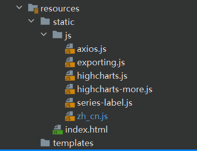


项目结构：

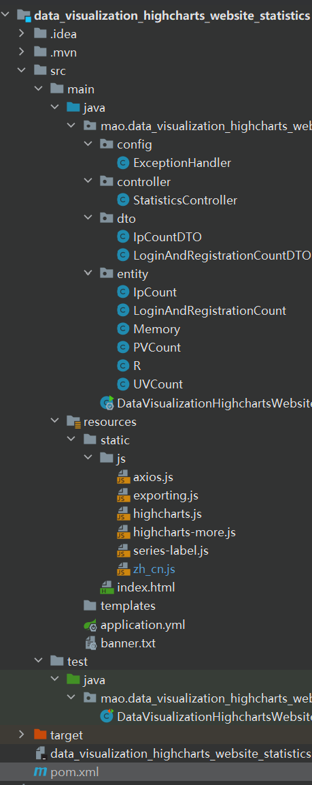


### 测试

启动后端

```sh
   .   ____          _            __ _ _
  /\\ / ___'_ __ _ _(_)_ __  __ _ \ \ \ \
 ( ( )\___ | '_ | '_| | '_ \/ _` | \ \ \ \
  \\/  ___)| |_)| | | | | || (_| |  ) ) ) )
   '  |____| .__|_| |_|_| |_\__, | / / / /
  =========|_|==============|___/=/_/_/_/
  :: Spring Boot ::                (v2.7.1)

           _____                    _____                   _______
          /\    \                  /\    \                 /::\    \
         /::\____\                /::\    \               /::::\    \
        /::::|   |               /::::\    \             /::::::\    \
       /:::::|   |              /::::::\    \           /::::::::\    \
      /::::::|   |             /:::/\:::\    \         /:::/~~\:::\    \
     /:::/|::|   |            /:::/__\:::\    \       /:::/    \:::\    \
    /:::/ |::|   |           /::::\   \:::\    \     /:::/    / \:::\    \
   /:::/  |::|___|______    /::::::\   \:::\    \   /:::/____/   \:::\____\
  /:::/   |::::::::\    \  /:::/\:::\   \:::\    \ |:::|    |     |:::|    |
 /:::/    |:::::::::\____\/:::/  \:::\   \:::\____\|:::|____|     |:::|    |
 \::/    / ~~~~~/:::/    /\::/    \:::\  /:::/    / \:::\    \   /:::/    /
  \/____/      /:::/    /  \/____/ \:::\/:::/    /   \:::\    \ /:::/    /
              /:::/    /            \::::::/    /     \:::\    /:::/    /
             /:::/    /              \::::/    /       \:::\__/:::/    /
            /:::/    /               /:::/    /         \::::::::/    /
           /:::/    /               /:::/    /           \::::::/    /
          /:::/    /               /:::/    /             \::::/    /
         /:::/    /               /:::/    /               \::/____/
         \::/    /                \::/    /                 ~~
          \/____/                  \/____/
  :: Github (https://github.com/maomao124) ::

2023-06-12 21:22:12.567  INFO 25136 --- [           main] onHighchartsWebsiteStatisticsApplication : Starting DataVisualizationHighchartsWebsiteStatisticsApplication using Java 1.8.0_332 on mao with PID 25136 (D:\程序\大四下期\data_visualization_highcharts_website_statistics\target\classes started by mao in D:\程序\大四下期\data_visualization_highcharts_website_statistics)
2023-06-12 21:22:12.568  INFO 25136 --- [           main] onHighchartsWebsiteStatisticsApplication : No active profile set, falling back to 1 default profile: "default"
2023-06-12 21:22:12.952  INFO 25136 --- [           main] o.s.b.w.embedded.tomcat.TomcatWebServer  : Tomcat initialized with port(s): 8082 (http)
2023-06-12 21:22:12.955  INFO 25136 --- [           main] o.apache.catalina.core.StandardService   : Starting service [Tomcat]
2023-06-12 21:22:12.956  INFO 25136 --- [           main] org.apache.catalina.core.StandardEngine  : Starting Servlet engine: [Apache Tomcat/9.0.64]
2023-06-12 21:22:12.994  INFO 25136 --- [           main] o.a.c.c.C.[Tomcat].[localhost].[/]       : Initializing Spring embedded WebApplicationContext
2023-06-12 21:22:12.994  INFO 25136 --- [           main] w.s.c.ServletWebServerApplicationContext : Root WebApplicationContext: initialization completed in 406 ms
2023-06-12 21:22:13.072  INFO 25136 --- [           main] o.s.b.a.w.s.WelcomePageHandlerMapping    : Adding welcome page: class path resource [static/index.html]
2023-06-12 21:22:13.124  INFO 25136 --- [           main] o.s.b.w.embedded.tomcat.TomcatWebServer  : Tomcat started on port(s): 8082 (http) with context path ''
2023-06-12 21:22:13.128  INFO 25136 --- [           main] onHighchartsWebsiteStatisticsApplication : Started DataVisualizationHighchartsWebsiteStatisticsApplication in 0.744 seconds (JVM running for 1.179)
2023-06-12 21:22:13.129  INFO 25136 --- [           main] onHighchartsWebsiteStatisticsApplication : 应用highcharts_website_statistics启动成功!地址：http://113.221.244.207:8082/index.html  或者：http://127.0.0.1:8082/index.html
2023-06-12 21:22:13.129  INFO 25136 --- [           main] onHighchartsWebsiteStatisticsApplication : 启动耗时：796ms
```


访问地址：http://127.0.0.1:8082/index.html


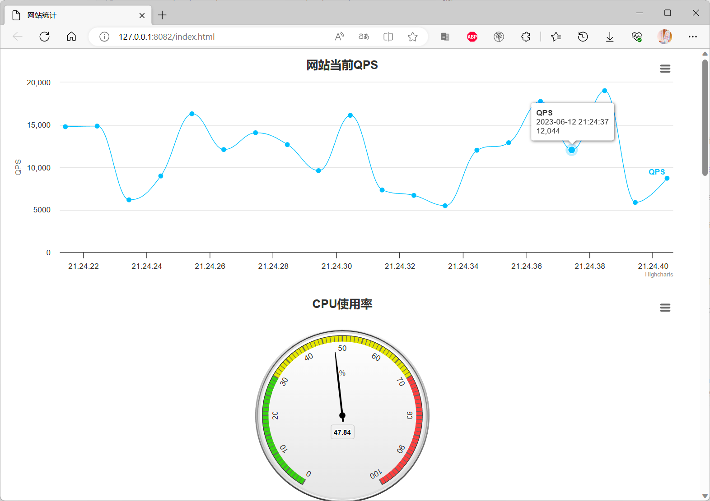


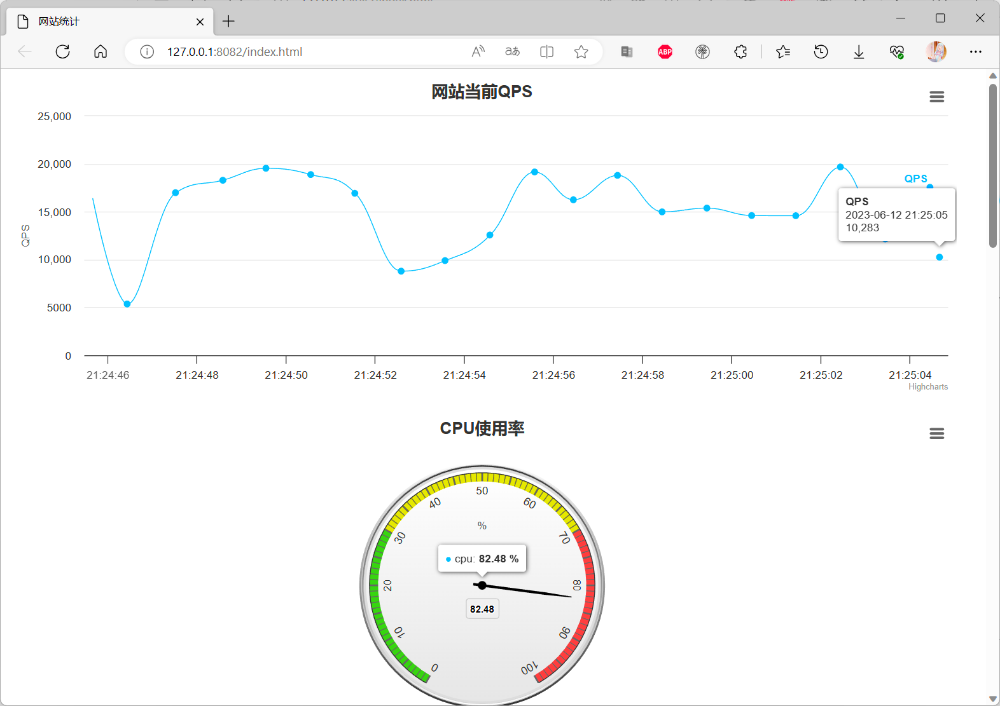


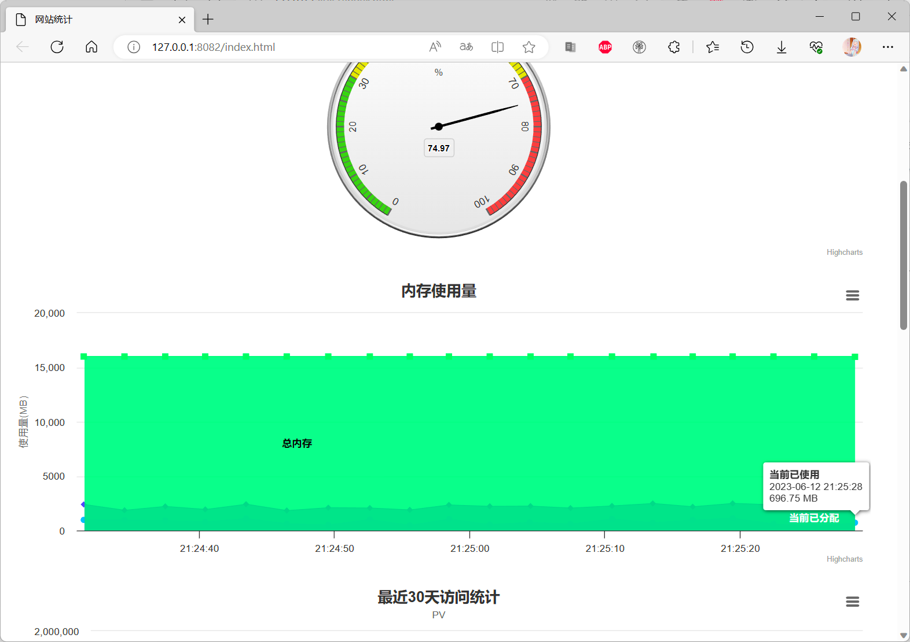


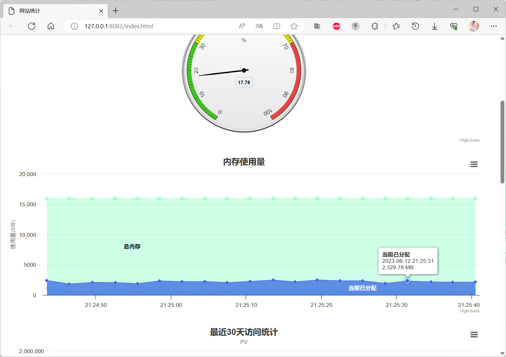


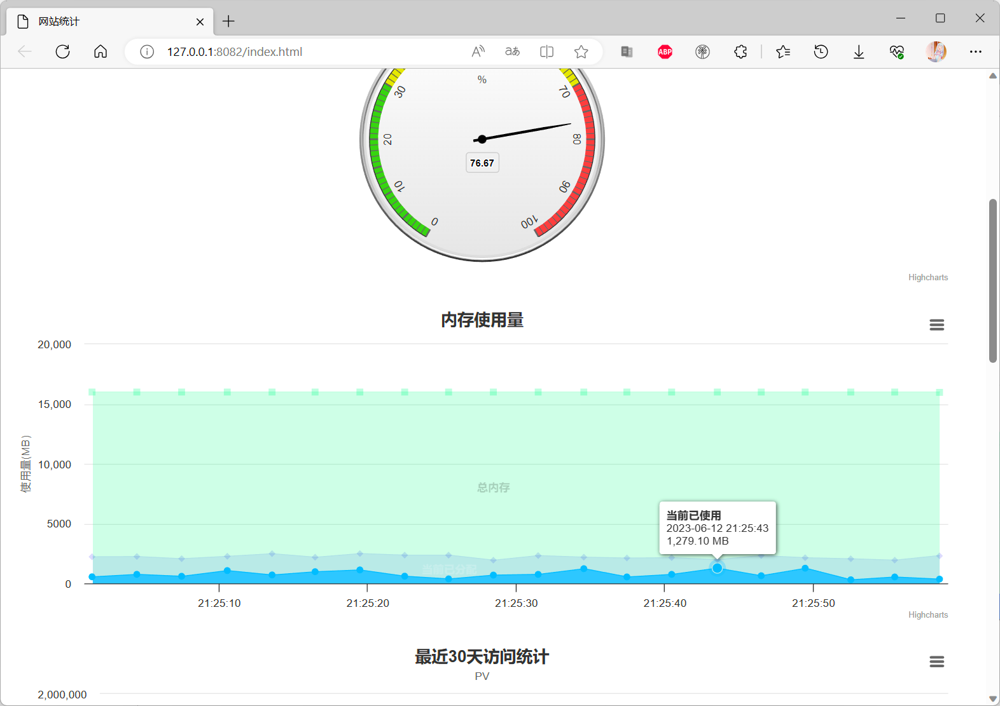


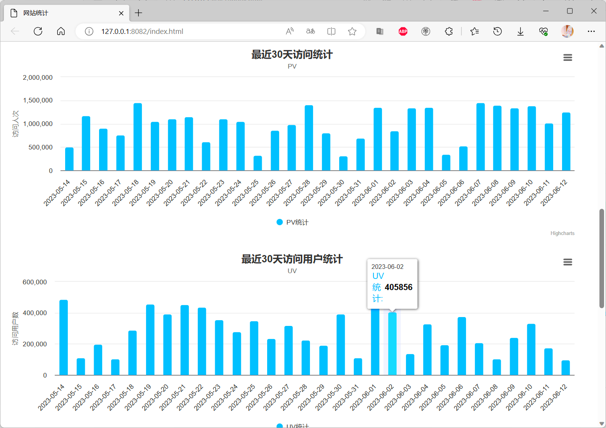


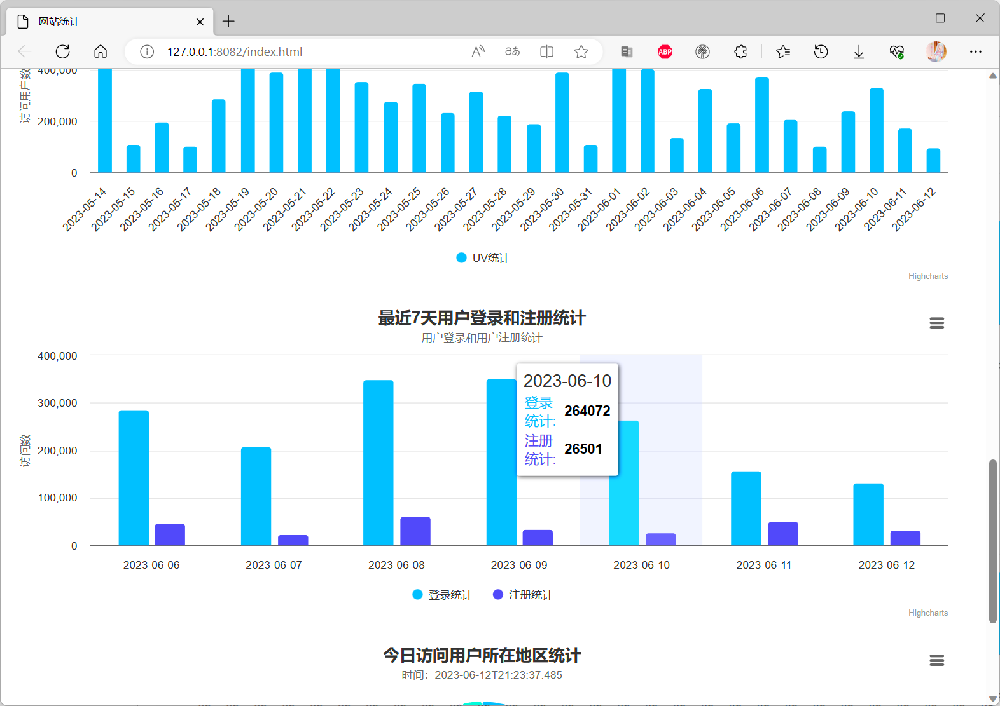


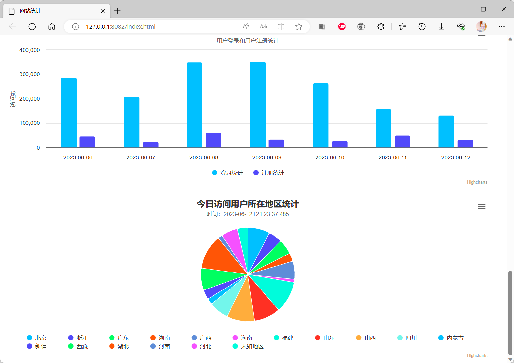


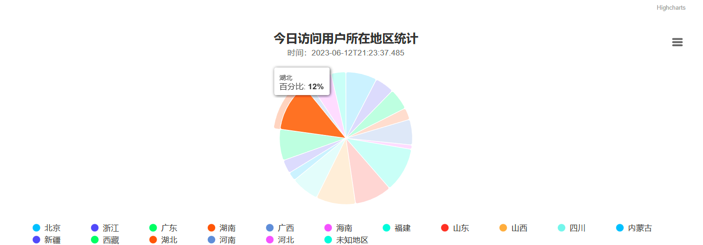


